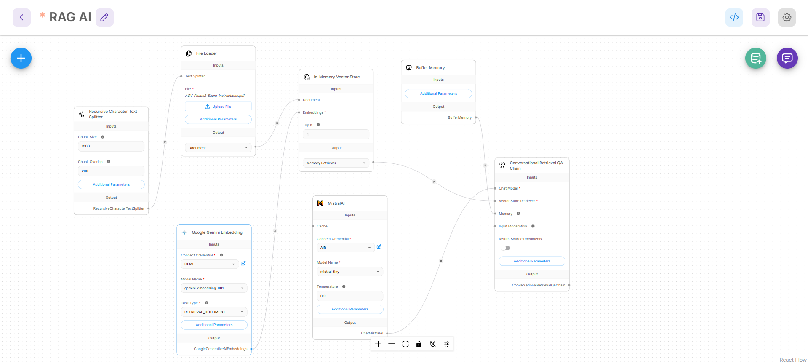
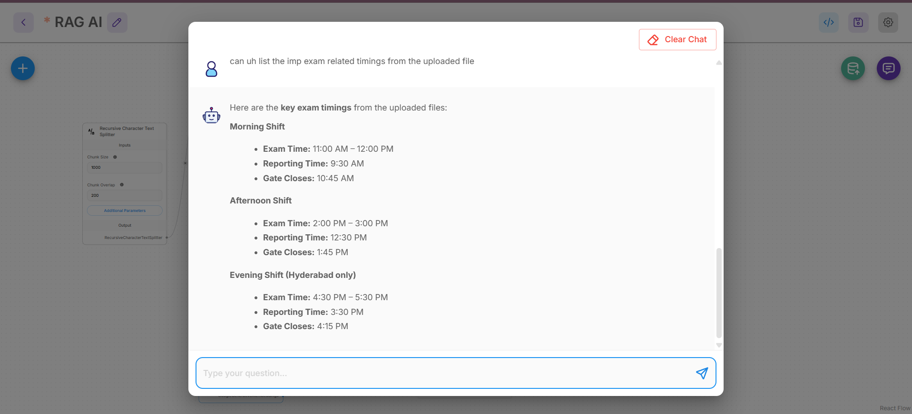

# RAG Chatbot using Flowise

## Overview

This project implements a Retrieval-Augmented Generation (RAG) chatbot using Flowise. The chatbot retrieves relevant information from uploaded documents using embeddings and vector search, then generates context-aware responses using a Large Language Model (LLM).

## Features

* Document-based question answering
* Semantic search using embeddings
* Conversational memory support
* Context-aware response generation
* Retrieval-Augmented Generation (RAG) pipeline

## Tech Stack

* Flowise
* Mistral AI
* Google Gemini Embeddings
* In-Memory Vector Store
* Conversational Retrieval QA Chain

## Workflow

File Loader → Recursive Character Text Splitter → Gemini Embeddings → In-Memory Vector Store → Memory Retriever → Mistral AI → Conversational Retrieval QA Chain

## Project Screenshots

### Workflow

### Chatbot Demo

## What I Learned

* Retrieval-Augmented Generation (RAG)
* Embeddings and semantic search
* Vector databases and retrieval
* LLM orchestration using Flowise
* Building AI applications with external knowledge sources

## Future Enhancements

* Source citations
* Multi-document support
* Improved UI
* Agentic workflows
* Study assistant features
